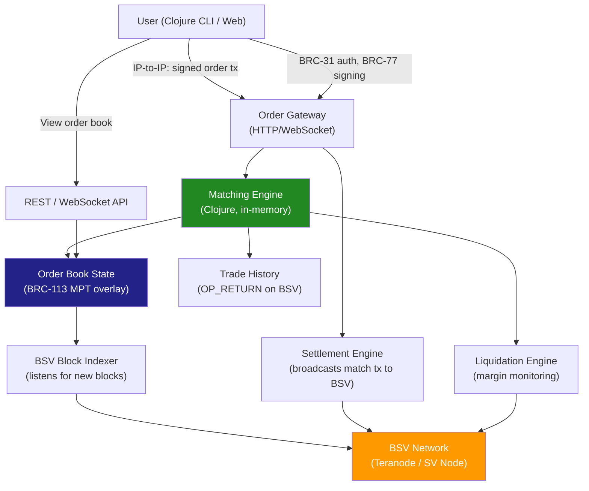

# On-Chain CLOB on BSV — Architecture & Roadmap

A design for building Hyperliquid-style on-chain Central Limit Order Book exchange on BSV, implemented in Clojure as an overlay service.

## Why This Can Work on BSV

Hyperliquid had to build a custom L1 because no existing chain could handle 200k orders/sec. BSV with Teranode targets 1M+ TPS — same throughput class — without forking the protocol. The key advantages:

- **No consensus to build**: BSV's PoW is battle-tested. We get Chronicle-restored opcodes, OTDA, locked protocol
- **Sub-cent fees**: Every order/cancel/match posts a transaction. At 0.1 cent each, 200k operations costs $200 — trivial for a liquid exchange
- **Overlay architecture**: Application-specific state indexing on top of the base layer, not a separate chain
- **IP-to-IP settlement**: Whitepaper Section 8 direct peer transactions for fast order submission
- **Clojure**: State management, STM, persistent data structures — naturally suited for an order book

## Architecture



### Components

#### 1. BSV Block Indexer
Clojure service that connects to SV Node or Teranode via `bsv-clj` RPC. For each new block, it:
- Scans transactions for known overlay protocol markers (OP_RETURN)
- Extracts order placement, cancellation, and settlement transactions
- Updates the local order book state
- Maintains MPT state root committed to BSV periodically

#### 2. Order Gateway
HTTP/WebSocket server accepting signed orders from users. Each order is:
- A BSV transaction with OP_RETURN payload (BRC-105 payment protocol)
- Signed with BRC-77 (user's private key)
- Optionally submitted IP-to-IP for lower latency
- Validated (signature, balance, margin) before entering the matching engine

#### 3. Matching Engine (Clojure)
The core. Pure Clojure, no side effects:
- Price-time priority order book (bid max-heap, ask min-heap)
- Matches aggressively on each incoming order
- Produces match events (pairs of maker/taker)
- Batch matches to reduce on-chain transactions
- Clojure's persistent data structures make snapshot/restore trivial

```clojure
(defprotocol OrderBook
  (submit-order [book order])
  (cancel-order [book order-id])
  (get-book [book pair depth])
  (match-trades [book]))

(defrecord Order [id pair side price qty filled status timestamp]
  ;; BRC-105 payment signed with BRC-77
  )
```

#### 4. Settlement Engine
Takes match events from the matching engine and:
- Constructs settlement transactions transferring assets between parties
- Posts them to BSV via Arc or direct P2P broadcast
- Returns txid to users
- Sub-cent fees per settlement

#### 5. Order Book State (BRC-113 MPT)
The order book is an overlay service:
- State stored as BRC-113 Merkle Patricia Trie
- Periodic MPT root commitment to BSV via OP_RETURN
- Anyone can independently verify the order book state against the chain
- Enables trustless audit without running the matching engine

#### 6. Liquidation Engine
Monitors open positions against oracle price feeds:
- Linear products: liquidate when margin ratio drops below threshold
- Perpetual swaps: funding rate payments, auto-deleveraging
- Liquidation orders get priority in the matching engine

## Data Flow

### Order Placement
```
1. User signs order (BRC-77) → submits to Gateway
2. Gateway validates signature + balance
3. Order enters matching engine
4. Engine checks for immediate matches
5. If match: settlement tx broadcast to BSV
6. If no match: order posted to OP_RETURN (optional, for transparency)
7. Overlay indexer picks it up from block
```

### Settlement
```
1. Match event produced (price, qty, maker, taker)
2. Settlement engine constructs tx:
   - Input: maker collateral UTXO
   - Output: taker receives asset + maker receives payment
   - OP_RETURN: match metadata
3. Broadcast to BSV network
4. Both parties verify txid
```

## Roadmap

### Phase 1: Spot Order Book (MVP)
- [ ] Block indexer connecting to bsv-clj
- [ ] Clojure matching engine (price-time priority)
- [ ] Order submission via BRC-77 signed transactions
- [ ] Basic settlement (asset-for-asset)
- [ ] Order book REST API
- [ ] BRC-113 MPT state root commitment
- [ ] Web interface (simple React or htmx)

*Deliverable: spot trading for one pair (e.g., BSV/USDC)*

### Phase 2: Margin Trading
- [ ] Collateral management (isolated margin)
- [ ] Oracle integration (BRC-105 price feed)
- [ ] Position tracking
- [ ] Liquidation engine
- [ ] Cross-margin (Clearinghouse-style unified state)

*Deliverable: 3x-10x leverage on spot pairs*

### Phase 3: Perpetual Swaps
- [ ] Funding rate mechanism
- [ ] Index price aggregation
- [ ] Auto-deleveraging
- [ ] Multi-collateral (USDC, BSV, ordinals as collateral)

*Deliverable: BTC/USD perp with on-chain CLOB matching*

### Phase 4: Production
- [ ] WebSocket streaming (order book depth, trades, positions)
- [ ] Agent keys (delegated trading from cold wallet — BRC-31)
- [ ] IP-to-IP order submission for latency-sensitive traders
- [ ] Dashboard: PnL, margin, trade history
- [ ] Stress testing at 100k orders/sec

## Dependencies

| Component | Library |
|---|---|
| BSV RPC | `bsv-clj` (Clojure RPC client) |
| BRC-77 signing | `clawsats-indelible` |
| BRC-31 auth | `clawsats-indelible` |
| BRC-105 payments | `clawsats-indelible` |
| HTTP server | `ring` + `reitit` |
| State persistence | `crux` or `datalevin` (local + overlay) |
| Broadcasting | `bsv-clj` / Arc |
| Margin engine | Custom Clojure |

## Comparison to Hyperliquid

| Dimension | Hyperliquid | BSV-CLOB |
|---|---|---|
| Consensus | HyperBFT (pipelined BFT) | BSV PoW (Teranode) |
| Throughput | 200k TPS | 1M+ TPS target |
| Finality | ~0.2s | Probabilistic (~1s for 1 conf) |
| Smart contracts | HyperEVM (Solidity) | sCrypt + overlays |
| State model | Clearinghouse monolith | UTXO + MPT overlay |
| Composability | Bridge-dependent | Native (same block) |
| Token required | HYPE (staking) | None (sub-cent fees) |
| Dev language | Rust/C++ (core) | Clojure (overlay) |
